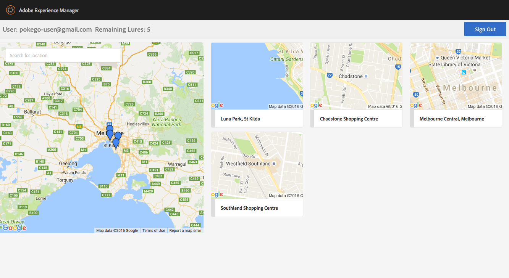

# PokeGo Lure AEM Client

[](https://travis-ci.org/mickleroy/aem-pokego-lure-client)

An AEM dashboard to manage lure modules in various locations.

## Installing

This project can be installed by downloading and deploying a pre-built CRX package from the [releases](https://github.com/mickleroy/aem-pokego-lure-client/releases).

Navigate to the CRX Package Manager at http://localhost:4502/crx/packmgr/index.jsp and upload the ZIP file.

## Using the application

[Video screencast](https://www.youtube.com/watch?v=QuUoPM76kUM)

The dashboard can be accessed at http://localhost:4502/etc/pokegolure/index.html and a shortcut is available in the Tools > General > Pokemon Go Lures. Note: A Pokemon Go account is required to use this application.



## Development Notes

### Building/deploying

This project uses Maven for building. Common commands:

From the root directory, run ``mvn -PautoInstallPackage clean install`` to build the bundle and content package and install to a CQ instance.

From the bundle directory, run ``mvn -PautoInstallBundle clean install`` to build *just* the bundle and install to a CQ instance.

### Creating a release

Create a release branch off the `master` branch
```
git branch release/X.X
```

Prepare the release (use vX.X for the tag)
```
mvn release:prepare
```

Push the branch to the repository
```
git push origin
```

Checkout the newly created tag and build the project
```
git checkout tags/vX.X
```
```
mvn clean package
```

Attach the CRX package to the release on Github.


